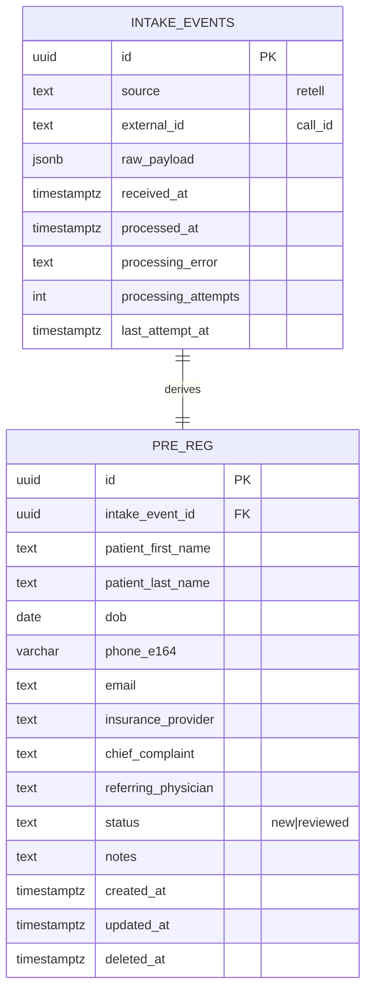

# Healthcare Intake Pipeline

Webhook → PostgreSQL → API pipeline for patient intake (pre-registration) records.

Built as a paid-test deliverable. Stack: Node.js (Express) + TypeScript + zod + raw SQL (`pg`) + `node-pg-migrate` + PostgreSQL + Docker.

## Live demo

> 🔗 **https://intake.mimind.me** — demo-only data, weekly wipe, scheduled takedown.
> Bearer tokens are in the Upwork application message.

## Why this shape

The paid-test brief is generic: *"webhook → JSON → Postgres → 1–2 GET endpoints."* This demo is deliberately shaped around Retell AI's webhook contract because that is the phase-1 integration called out in the job posting's "What You Will Build (First 2–4 Weeks)" section.

The payload schema, event lifecycle (`call_started`/`call_ended`/`call_analyzed`/...), and `X-Retell-Signature` format (`v={ts},d={hex}`, HMAC-SHA256 over `JSON.stringify(body) + timestamp`) match [Retell's documented contract](https://docs.retellai.com/features/webhook-overview). See [`RETELL_NOTES.md`](./RETELL_NOTES.md) for the full research trail — source URLs, quoted evidence, and the one thing Retell does NOT standardize (patient-data field names — these are our product contract with the Retell agent configuration, documented there).

## Design decisions (and why)

1. **Two tables**, not one — `intake_events` (raw `jsonb` audit + idempotency key) + `pre_reg` (structured operational data). Raw payload is source of truth; derived fields are reconstructable.
2. **Idempotent webhook** via `INSERT ... ON CONFLICT (source, external_id) DO NOTHING RETURNING id`. Retries don't duplicate records; the check-and-insert is atomic.
3. **Explicit failure recovery** — if derivation fails, the event is still stored with `processing_error` + `processing_attempts`. Recover via `POST /api/intake-events/:id/reprocess`. No silent data loss; no retry storms on our own bugs (we return `200`, not `500`, so the sender doesn't retry a condition a retry can't fix).
4. **Composite cursor pagination** — `(created_at, id)` so identical timestamps don't cause skip/duplicate across pages. Opaque base64.
5. **Validators are shared** between webhook derivation and PATCH — same E.164, same date parse, same email format. No "trust the client" string fields.
6. **No ORM.** Plain SQL, visible. `node-pg-migrate` with `--lock` so concurrent startups don't race.
7. **`updated_at` via Postgres trigger** — not the app. Consistency enforced once.
8. **Soft delete on `pre_reg`** — healthcare retention discipline, not aesthetic.
9. **PII hygiene** — pino redacts `Authorization`, signature headers, transcripts, emails, DOBs, phones, in both request and response logs.
10. **Retell-specific signature verifier with replay protection** — `X-Retell-Signature` parsed per their `v={ts},d={hex}` format, HMAC-SHA256 recomputed from `JSON.stringify(body) + timestamp`, signatures older than 5 minutes rejected. Timing-safe compare throughout.
11. **Event filtering** — Retell fires multiple webhooks per call (`call_started`, `call_ended`, `call_analyzed`, transcript updates). We only create `pre_reg` on `call_ended`; other events return `200 ignored_event`. Prevents non-terminal states from winning the idempotency race and dropping the event that actually has patient data.

## Data model



## API

| Method | Path | Purpose |
| --- | --- | --- |
| `POST` | `/webhooks/retell` | Receive + validate + idempotent insert + derive |
| `POST` | `/api/intake-events/:id/reprocess` | Re-run derivation after failure |
| `GET` | `/api/pre-reg` | Paginated list (cursor) |
| `GET` | `/api/pre-reg/:id` | Single record + event metadata |
| `PATCH` | `/api/pre-reg/:id` | Partial update with full validation |
| `GET` | `/healthz` | DB-backed health check |

### Webhook auth

- If `WEBHOOK_SIGNATURE_SECRET` is set (real Retell traffic): verify `X-Retell-Signature` per [Retell's documented scheme](https://docs.retellai.com/features/secure-webhook) — HMAC-SHA256, `v={ts},d={hex}` format, 5-minute replay window.
- Otherwise (demo mode): `Authorization: Bearer $DEMO_BEARER_TOKEN`. Lets a reviewer exercise the webhook without Retell credentials.

### API auth

`Authorization: Bearer $API_BEARER_TOKEN` on every `/api/*` endpoint.

### Soft-deleted records

`pre_reg` rows with `deleted_at IS NOT NULL` are never returned by the API (they 404). They remain in the database for retention; direct SQL is the only read path. Retention without a read path is theater — this is the stated tradeoff.

## Quick try (against the live demo)

```bash
# Submit a demo event
curl -X POST {TEST_URL}/webhooks/retell \
  -H "Authorization: Bearer $DEMO_BEARER_TOKEN" \
  -H "Content-Type: application/json" \
  -d @seed/sample-payload.json

# List pre-reg records
curl {TEST_URL}/api/pre-reg -H "Authorization: Bearer $API_BEARER_TOKEN"

# Fetch one
curl {TEST_URL}/api/pre-reg/<id> -H "Authorization: Bearer $API_BEARER_TOKEN"

# Update status + notes
curl -X PATCH {TEST_URL}/api/pre-reg/<id> \
  -H "Authorization: Bearer $API_BEARER_TOKEN" \
  -H "Content-Type: application/json" \
  -d '{"status":"reviewed","notes":"Reviewed by coordinator"}'
```

Posting the same payload twice produces exactly one `pre_reg` row — the second call returns `{ "status": "duplicate", ... }`.

## Run locally

```bash
cp .env.example .env
# Edit .env: set DEMO_BEARER_TOKEN and API_BEARER_TOKEN to values of your choice
docker compose up -d --build
# App on http://localhost:3000; migrations run automatically on container start.
curl -H "Authorization: Bearer <demo-token>" \
  -H "Content-Type: application/json" \
  -d @seed/sample-payload.json \
  http://localhost:3000/webhooks/retell
```

## Deploy to a VPS

1. Point DNS: `A` record `<subdomain>` → VPS IP.
2. `git clone`, `cp .env.example .env`, fill secrets.
3. `docker compose up -d --build`.
4. `sudo certbot --nginx -d <subdomain>` (nginx on host reverse-proxies to `127.0.0.1:3000`).
5. Smoke-test: `curl https://<subdomain>/healthz`.

nginx should set `client_max_body_size 1m`, forward `X-Request-Id` (using nginx's `$request_id`), and enforce HTTPS. Postgres is never exposed on the host — internal docker network only.

## What's intentionally **not** in scope

- Auth / login UI for coordinators
- Referral routing (phase 2 of the real engagement)
- Multi-tenancy
- Admin dashboard with edit forms
- AWS-specific deploy — Docker is portable; same primitives on EC2/RDS
- Backups — not shipped, not claimed. Half-claims ("`pg_dump` cron mentioned in README, not shipped") are worse than silence. Real backups belong in phase-2 ops.

## PHI and demo discipline

- All seed / demo data is obviously synthetic (`Test Patient`, `+15555550100` from the reserved NANP test range, `test@example.com`).
- No real PHI is stored. Volume-level encryption is not enabled. This is a demo.
- Data is wiped weekly; the demo URL has a stated takedown date (`DEMO_TAKEDOWN_DATE` in `.env.example`).
- Logs redact `Authorization`, signature header, transcript body, emails, phone numbers, and DOBs.
